+++
title = "Bitácora"
draft = false
weight = 6
+++
## 14 mayo 2025

Taller de corte 2D con laser: sesión de acercamiento al manejo de máquinas láser partiendo de la creación y preparación de imágenes vectoriales. Gracias a tod+s los que habés pasado por el taller, a Daniel por la presentación y a Mónica y José Enrique por la organización.  
## 13 mayo 2025
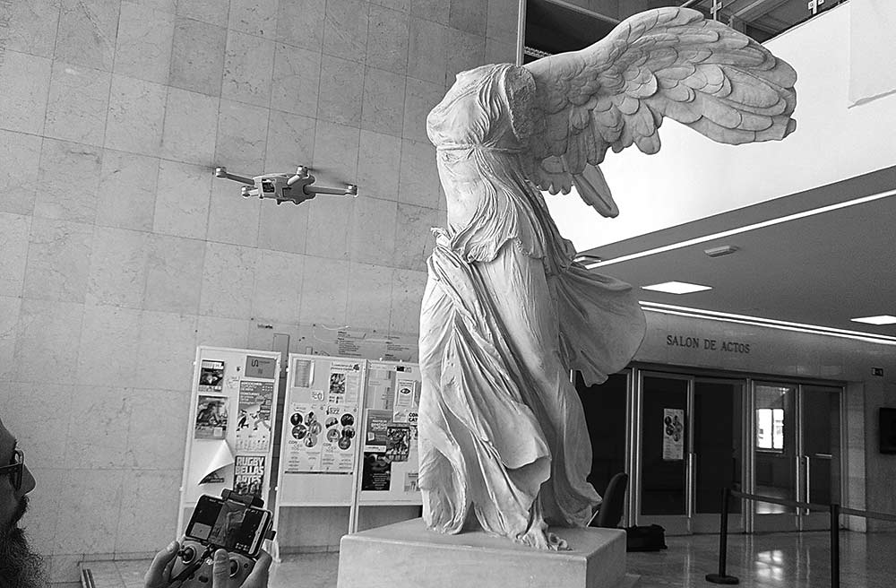
Taller de corte 2D con laser: sesión de acercamiento al manejo de máquinas láser partiendo de la creación y preparación de imágenes vectoriales. Gracias a tod+s los que habés pasado por el taller, a Daniel por la presentación y a Mónica y José Enrique por la organización.  

## Fablab * Digitalización 3D
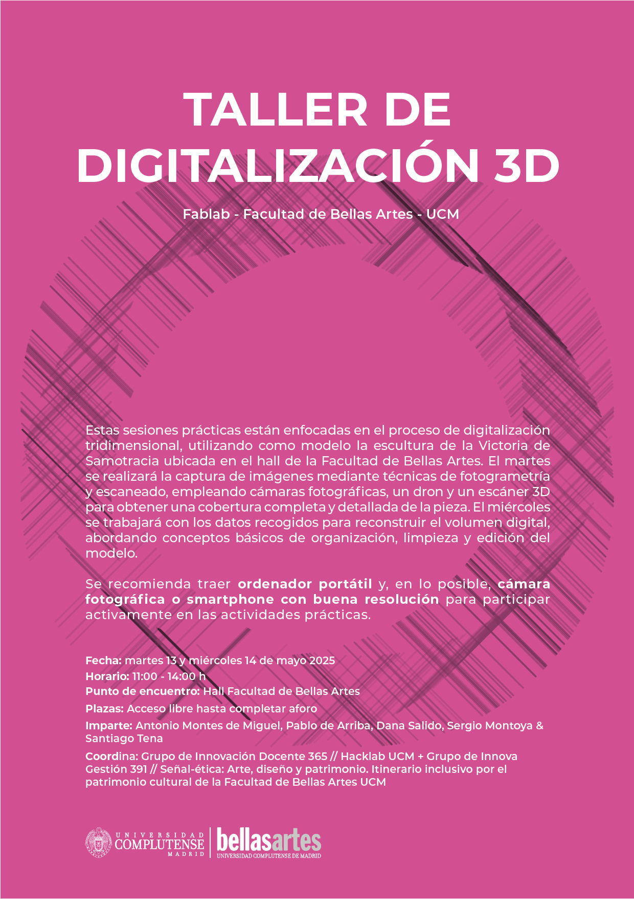  

## 25 marzo 2025

Taller de corte 2D con laser: sesión de acercamiento al manejo de máquinas láser partiendo de la creación y preparación de imágenes vectoriales. Gracias a tod+s los que habés pasado por el taller, a Daniel por la presentación y a Mónica y José Enrique por la organización.  
## Fablab * Corte 2D
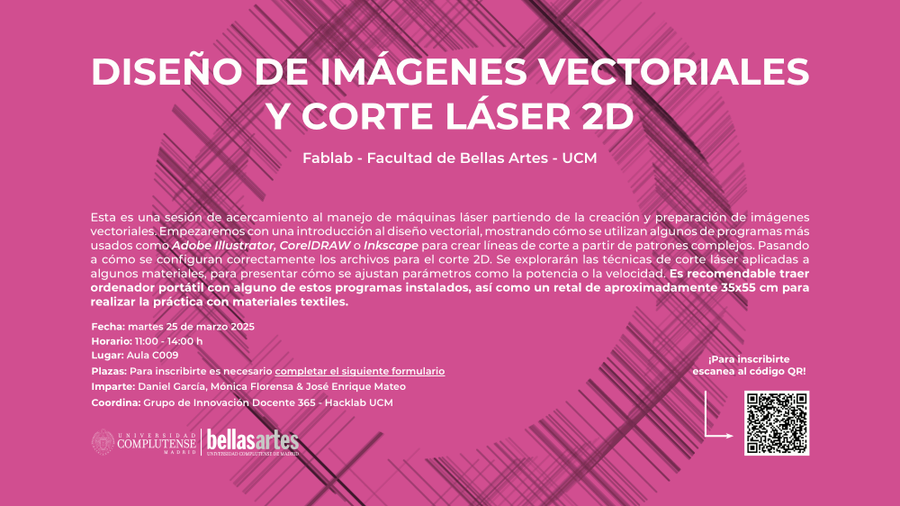  

## 25 febrero 2025
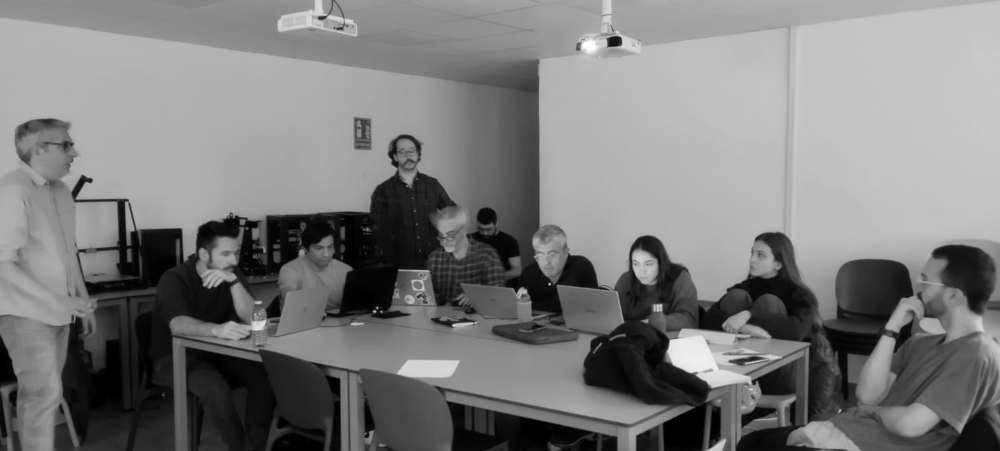
Taller de Freecad, software de modelado CAD de código abierto. Gracias a tod+s los que habés pasado por el taller, a Javi y Ricardo por la presentación, a Juan por el móvil y a Rafa por la foto :-)  

## Fablab * FreeCAD
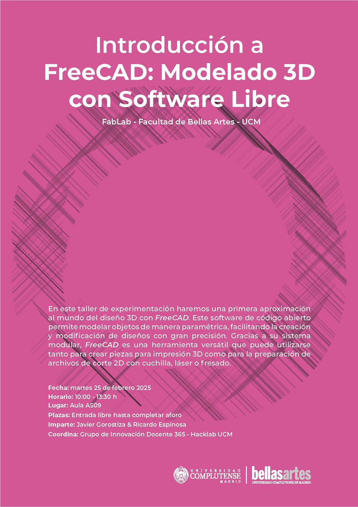  

## 29 enero 2025
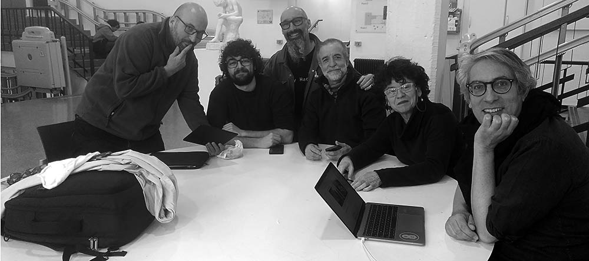
Planificando las actividades del primer semestre de 2025.  

## 20 noviembre 2024
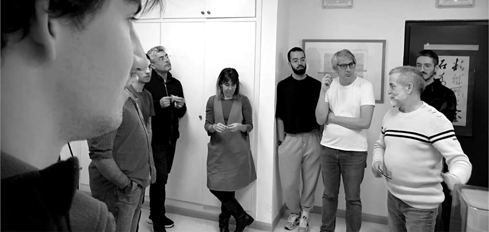
Primer taller del curso, ponemos en marcha la impresora de resina. Gracias Pablo por compartir conocimeinto, y a Rafa por la foto!  

## Fablab * Hello World 
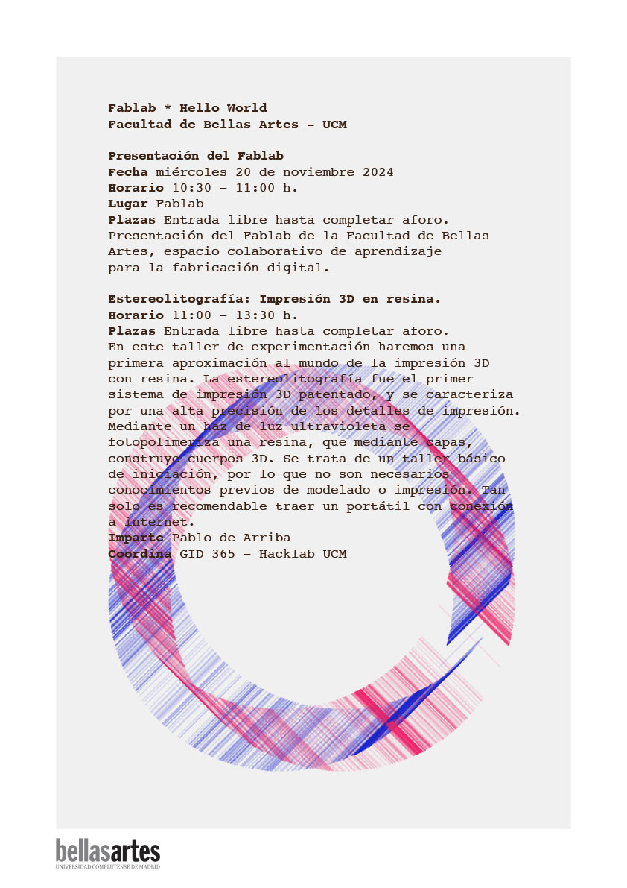  
 
## 1 octubre 2024
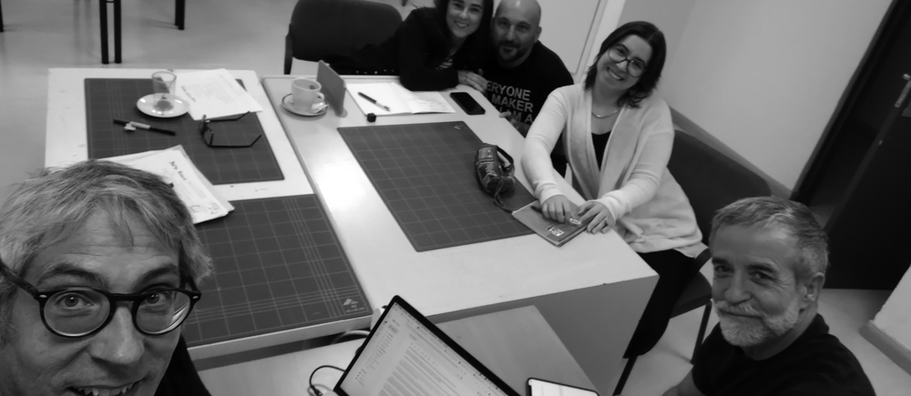
Inicio del proyecto del curso 2024-25 con nuevas caras y nuevos proyectos para comenzar los encuentros de este curso.  

## 30 mayo 2024
Cierre del proyecto del curso 2023-24 // En esta última sesión hemos trabajado con impresión 3D y hemos hecho un cierre del Grupo de Innovación, buen trabajo!.

## 11 abril 2024
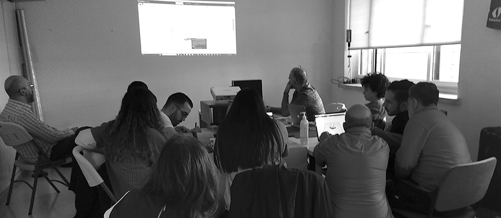
Impresión 3D // En esta sesión hemos repasado cuáles son los parámetros básicos de impresión.

## 21 febrero 2024
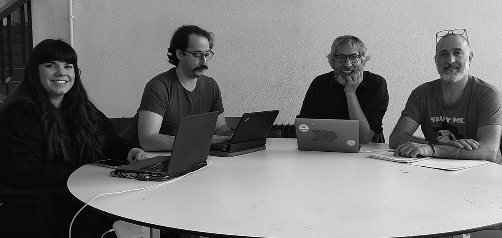
Sesión de planificación // Una vez terminado el primer bloque de digitalización comenzamos a revisar propuestas y planificar el siguiente bloque: Impresión 3D. Gracias a Pepe por la foto!

## 6 febrero 2024

Modelado 3D // Revisión y posibilidades de los diferentes tipos de software que estamos usando actualmente para modelar en 3D. La oferta es amplia: ZBrush, Maya, Blender, Fusion 360, Freecad, Openscad... Gracias a Sergio, Juan, Carlos, Rafa y Ricardo por sus demos, y a Rafa por la foto!

## 12 diciembre 2023
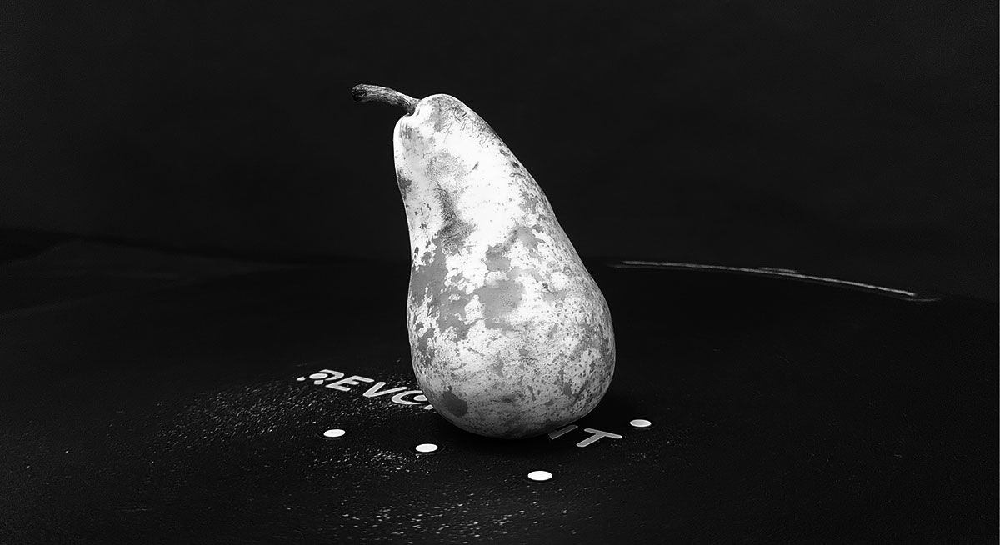
Sesión práctica // Prácticas de escaneado 3D y fotogrametría // Hoy hemos puesto en práctica lo visto anteriormente en las sesiones de fotogrametría y escaneado 3D. Gracias de nuevo a Juanvi y Pablo, a Ángel por preparar el aula y el software, y a Antonio por sus explicaciones sobre meshroom!

## 15 noviembre 2023
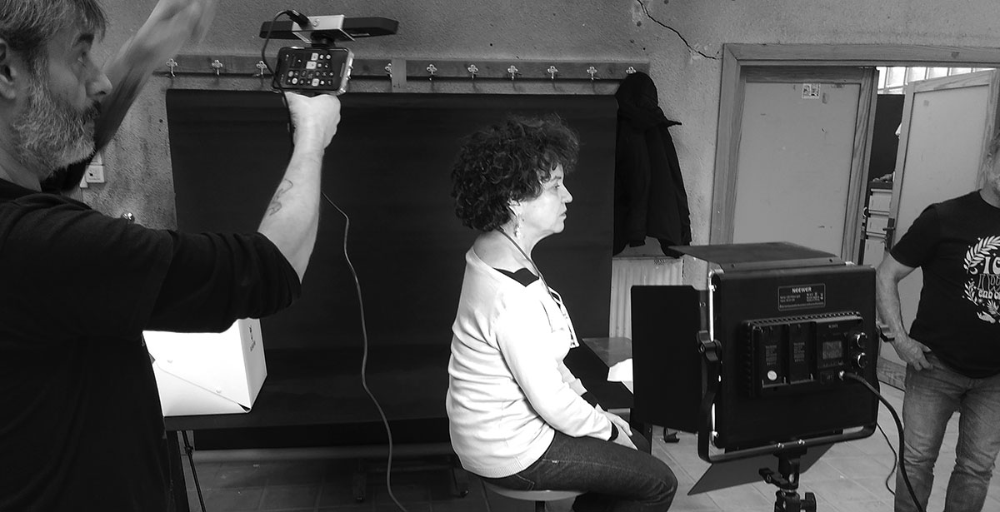
Escaneado 3D // En esta sesión hemos estado probando el escanner Revopoint Range con base giratoria, que funciona especialmente bien para cuerpo entero. Gracias a Juanvi y Pablo por compartir!

## 31 octubre 2023

Fotogrametría // Hoy sesión de fotogrametría en el aula de escultura. Gracias a Pablo por la organización y explicación y a Fran por la foto!

## 26 septiembre 2023
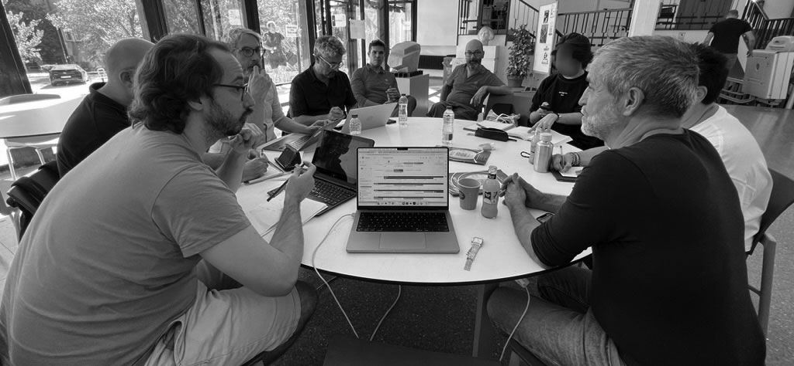   
Hello World // Hoy comenzamos la actividad del grupo de innovación docente. Las diferentes maneras de abordar el flujo de trabajo, o las opciones que utilizamos a la hora de digitalizar los objetos que fabricaremos posteriormente centran el debate. Gracias a Pilar del Puerto por la foto!
