+++
title = "Proyectos"
draft = false
weight = 5
+++
## Digitalización
#### Fotogrametería de un cráneo
**[Ricardo Espinosa Ruiz](https://www.ucm.es/directorio?id=30024) y Rafael Parrilla con fotos de [Pablo de Arriba](https://www.ucm.es/directorio?id=8570)**  
En este proyecto vamos a partir de las fotos realizadas a un modelo e un cráneo para posteriormente con [Meshroom](https://alicevision.org/#meshroom) conseguir un volumen que nos permita posteriormente imprimirlo. En esta tira de fotos puedes ver cuales han sido las posiciones de las tomas, y en el apartado de digitalización encuentras más detalles a cerca del proceso:  
  
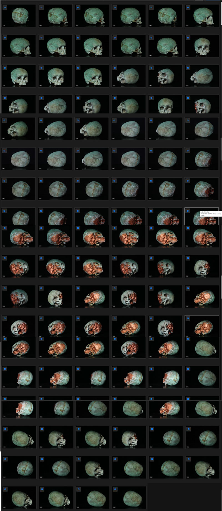  
  
Las imágenes de las que partimos están en formato RAW para obtener la mejor resolución de partida, pero Meshroom no puede leer este tipo de archivo, por lo que hemos creado una acción en photoshop para pasar de 16 a 8 bits, y convertirlas a formato .TIF.  
Abrimos Meshroom e inciamos los isguientes pasos:  
1. Importamos en Meshroom las fotos (File>Import Images).
2. Guardamos el proyecto (File>Save)
3. En el menú de la parte superior clicamos el botón START. Veremos como en las cajas de Graph Editor se van procesando los pasos, y la linea verde que inidca un procesamiento correcto va avanzando de una caja a la siguiente.  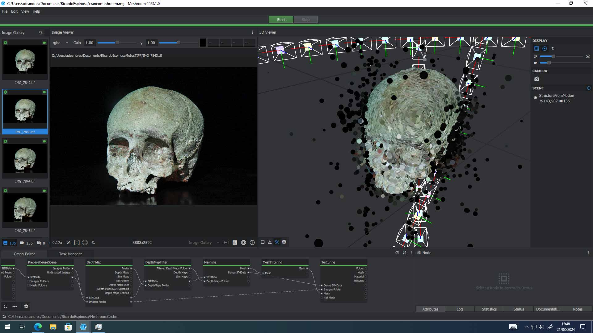 
4. Buscamos la carpeta en la que hemos guardado el proyecto, y vemos como se ha creado dentro una con nombre 'MeshroomCache'. Dentro de ella, en la capeta 'Meshing' tenemos el .OBJ creado. Este archivo lo conservamos, pero tiene mucha resolución, por lo que para imprimirlo posteriormente vamos a reducir le densidad de la malla. 
5. Inniciamos Blender e importamos el .OBJ que se ha creado en la carpeta MeshroomCache>Meshing.
6. En el panel lateral derecho despues de seleccionar el cuerpo 3D, malla , etc un icono de llave inglesa nos deja activar modificadores. Escogemos "Decimate" o "decimar" depende del idioma que tenga.

## Modelado 3D
#### Exportar desde Blender una pieza con medidas exactas para impresión 3D
**[Juan G. Leiva](https://www.ucm.es/directorio?id=36623) y [Ricardo Espinosa Ruiz](https://www.ucm.es/directorio?id=30024)**

La exportación de modelos desde Blender hacia impresoras tridimensionales requiere atención especial a la precisión dimensional. Un error común consiste en desatender las unidades de medida durante el modelado, lo que resulta en piezas imprimidas con tamaños inesperados o incompatibles con el montaje planificado. Este procedimiento garantiza que la pieza exportada conserve las medidas exactas definidas en el proyecto de diseño.

El primer paso consiste en establecer claramente las dimensiones de la pieza dentro de Blender. En la vista de propiedades, accedemos a la pestaña SCENE (indicada con la flecha azul en la imagen), donde seleccionamos las unidades de trabajo que utilizaremos en milímetros, que es el estándar en la mayoría de impresoras tridimensionales. Esta declaración explícita de unidades previene inconsistencias durante la exportación.

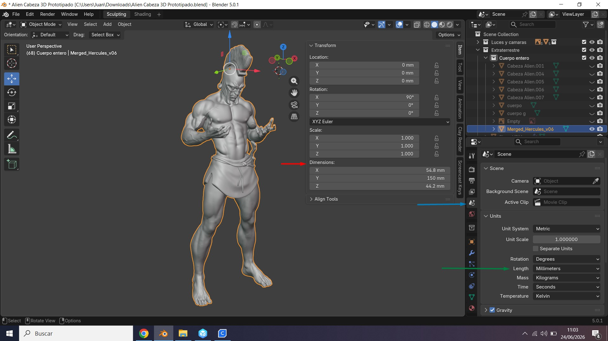

Una vez completado el modelado y verificadas las dimensiones en Blender, procedemos a la exportación. Accedemos al menú File > Export > STL, que es el formato estándar reconocido por los software de laminado (slicing). En el cuadro de diálogo de exportación, el parámetro SCALE debe establecerse en 1000, independientemente de cuál haya sido la unidad de trabajo seleccionada previamente. Este valor asegura la conversión correcta entre las unidades internas de Blender y el milímetro, garantizando que las medidas se mantengan fielmente en el archivo exportado.

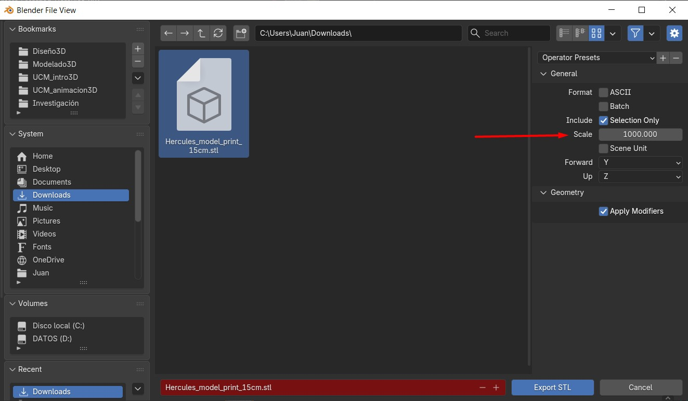

Finalmente, abrimos el archivo STL resultante en Cura (o el software de laminado correspondiente a tu impresora). En esta etapa realizamos la verificación crítica: comprobamos que la pieza se haya importado con las dimensiones planificadas, comparándolas con los parámetros que establecimos inicialmente en Blender. Esta confirmación visual antes de enviar a impresión previene fallos costosos de material y tiempo de máquina.

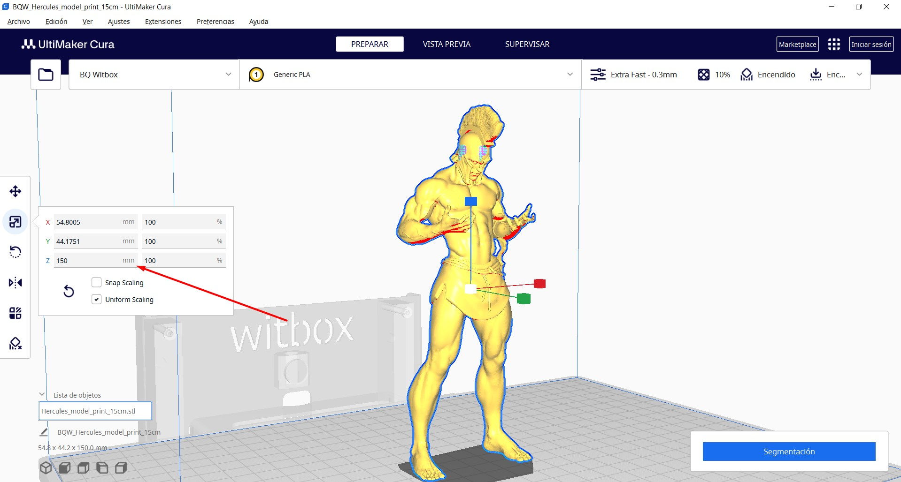

#### Redondear esquinas con OpenScad
**[Ricardo Espinosa Ruiz](https://www.ucm.es/directorio?id=30024)**  
Vamos a modelar con [OpenScad](https://openscad.org/) una pieza que nos va a servir de base para apoyar unas vias de tren en una maqueta. Este ejercicio esta basado en la idea de como redondear piezas utilzando la función 'offset' que se explica en este [fantástico tutorial](https://learn.cadhub.xyz/docs/definitive-beginners/your-openscad-journey). Comenzamos abriendo un nuevo archivo en OpenSacad y guardándolo en la carpeta correspondiente. Nos va  aresultar muy útil hacer un boceto con todas la mediadas que necesitemos. Una vez tenemos las medidas, las incluimos como variables para poder utlizarlas en nuesto modelado:  
  
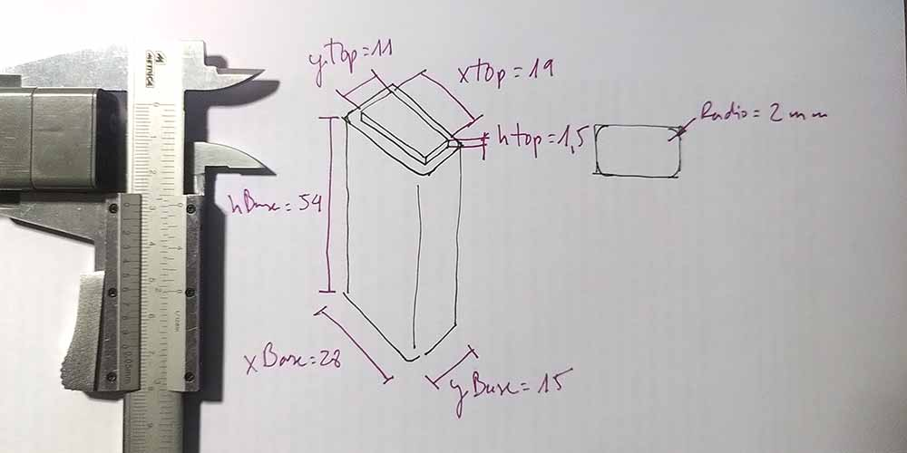 
  
~~~
xBase=28;
yBase=15;
xTop=19;
yTop=11;
alturabase=54;
alturaTop=1.5;
redondeo=2;
~~~  
Una vez incluidas, vamos a comenzar modelando la base y para ello dibujamos el cuadrado que la determine. la función "square" crea un cuadrado, y entre parténsis indicamos las mediadas 'x' e 'y':  
~~~
xBase=28;
yBase=15;
xTop=19;
yTop=11;
alturabase=54;
alturaTop=1.5;
redondeo=2;

square([xBase,yBase]);
~~~
Posteriormente hacemos une extrusión con la altura deseada:
~~~
xBase=28;
yBase=15;
xTop=19;
yTop=11;
alturabase=54;
alturaTop=1.5;
redondeo=2;

linear_extrude(alturabase)  
square([xBase,yBase]);
~~~
Ahora hacemos lo mismo con la parte superior
~~~
xBase=28;
yBase=15;
xTop=19;
yTop=11;
alturabase=54;
alturaTop=1.5;
redondeo=2;

linear_extrude(alturabase)  
square([xBase,yBase]);

linear_extrude(alturaTop)
square([xTop,yTop]);
~~~
No vemos la pieza que hemos llamado 'Top' porque está oculta dentro de la base, para desplazarla y que podamos verla incluimos la función translate:  
~~~
xBase=28;
yBase=15;
xTop=19;
yTop=11;
alturabase=54;
alturaTop=1.5;
redondeo=2;

linear_extrude(alturabase)  
square([xBase,yBase]);

translate([0,0,alturabase])
linear_extrude(alturaTop)
square([xTop,yTop]);
~~~
Ambos cuadrados cudrados comienzan a dibujarse desde el centro de coordenadas, pero incluyendo 'center=true' en cada uno de ellos, podemos hacer que se dibujen desde su centro:  
~~~
xBase=28;
yBase=15;
xTop=19;
yTop=11;
alturabase=54;
alturaTop=1.5;
redondeo=2;

linear_extrude(alturabase)  
square([xBase,yBase], center=true);

translate([0,0,alturabase])
linear_extrude(alturaTop)
square([xTop,yTop], center=true);
~~~
Por útltimo y para conseguir el redondeo, lo hacemos tal y como viene explicado en [esta web](https://learn.cadhub.xyz/docs/definitive-beginners/adding-fillets), quedando de la siguiente manera:  
~~~
xBase=28;
yBase=15;
xTop=19;
yTop=11;
alturabase=54;
alturaTop=1.5;
redondeo=2;

linear_extrude(alturabase){
    offset(redondeo)offset(-redondeo*2)offset(redondeo){
    square([xBase,yBase], center=true);
    }
}

translate([0,0,alturabase]){
        linear_extrude(alturaTop){
        offset(redondeo)offset(-redondeo*2)offset(redondeo){
        square([xTop,yTop], center=true);
        }
    }
}
~~~
Como hemos modelado la pieza de manera paramétrica, ahora basta con modificar alguna variable para que se ajuste todo el modelo. Una vez tenemos la pieza con las medidas deseadas, basta con renderizar la pieza y descargar el .STL.  
## Corte 2D  
#### Crear un volumen a partir de corte 2D con Slicer for Fusion 360  
**[Ricardo Espinosa Ruiz](https://www.ucm.es/directorio?id=30024)**  
Para este proyecto vamos a ver paso a paso como crear un volumen 3D realizado con corte 2D utilizando [Slicer for Fusion 360](https://www.autodesk.com/support/technical/article/caas/tsarticles/ts/3yg7zznS94MHNDG7KMV8Qg.html).  
1. Lo primero que vamos a hacer es tomar nota del grosor del material que vamos a cortar. En este caso el contrachapado tiene un grosor de 3,7 mm.
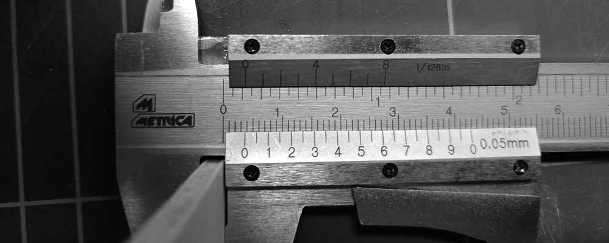  

2. Hacemos un cuadrado de 40 mm de lado y lo cortamos con la misma velocidad y potencia con la que posteriormente cortaremos la pieza. En este caso los parámetros que pondremos para nuestra máquina para cortar el contrachapado de este espesor son: velocidad 10 y potencia 25. A continuación, medimos el cuadrado cortado, y vemos que mide 39,9 mm, por lo que sabemos que el láser ha quitado 0,05 mm por cada lado (40-39,9=0,1 /2 = 0,05).  
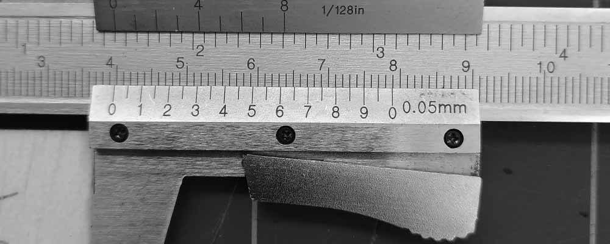  
  
3. Tomamos nota del tamaño de la plancha que vamos a cortar, en nuestro caso de 270x350 mm.
   
4. Creamos un volumen en cualquier programa de modelado 3D, y exportamos el .STL.  
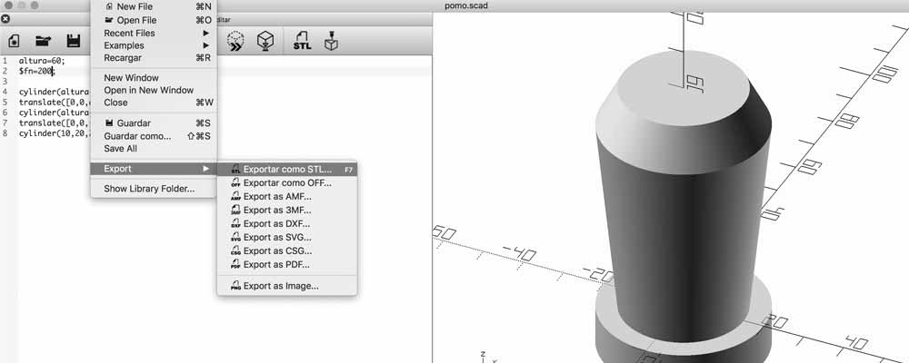
  
5. Abrimos Slicer e importamos el .STL. Si lo importa en una posición que no nos gusta, podemos girar la pieza antes de importarla en la ventana de selección de archivo: en la parte inferior elegimos el eje correcto.  
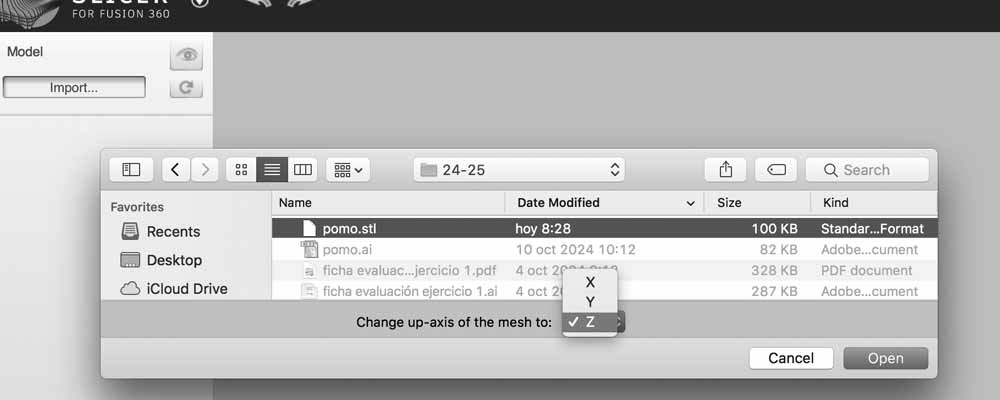

6. Clicamos en el icono del lápiz en el apartado “manufacturing settings”, y en la ventana emergente creamos un nuevo material clicando en el más que sale en la parte inferior izquierda.
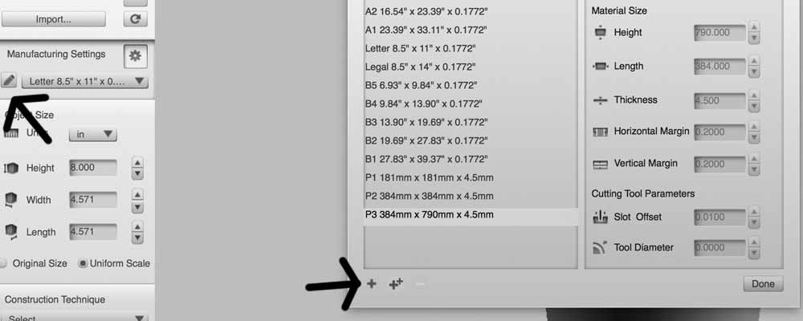

7. Ponemos un nombre al nuevo material e incluimos los siguientes datos: a) indicamos medidas en mm; b y c) el ancho y largo de la plancha que vamos a cortar; d) el espesor del material y e) la cantidad de material que hemos viso que se come el láser.
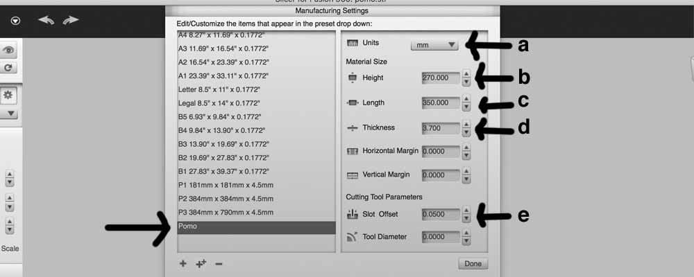

8. Le damos a “DONE”, y nos aseguramos de que hemos elegido el material recién creado.
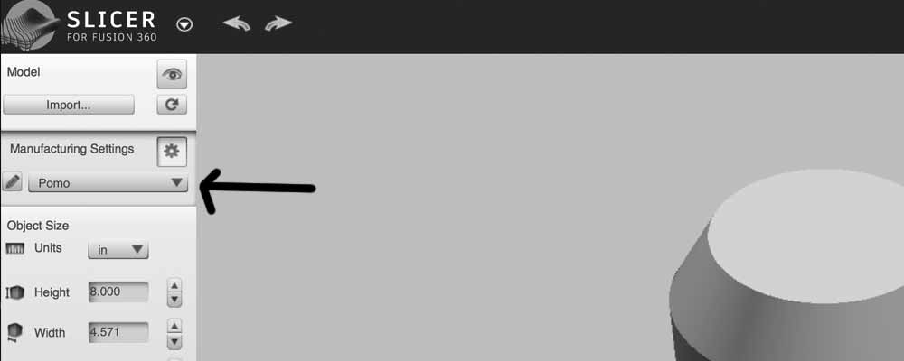

9. Comprobamos el tamaño del modelo, que las medidas estén en mm y que sean correctas.  
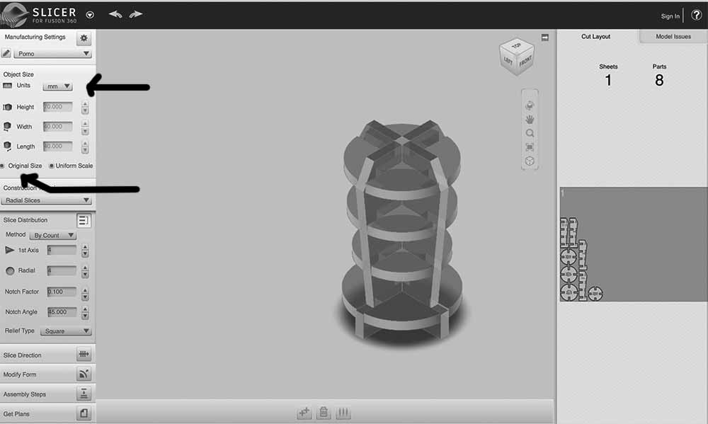  
10. Elegimos el sistema de construcción técnica que queremos usar y lo adaptamos a nuestra pieza.  
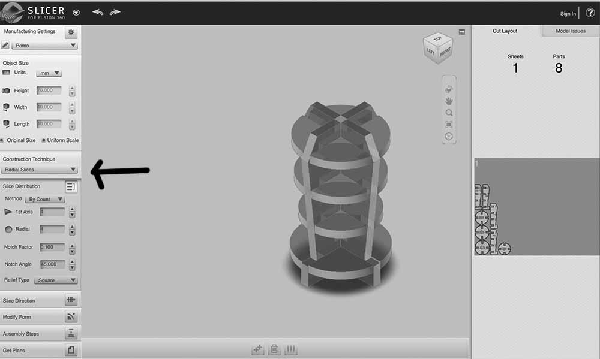  
11. En “Get Plans” exportamos el EPS. Es importante descargarlo en el escritorio del ordenador para que el programa reconozca correctamente la ruta.
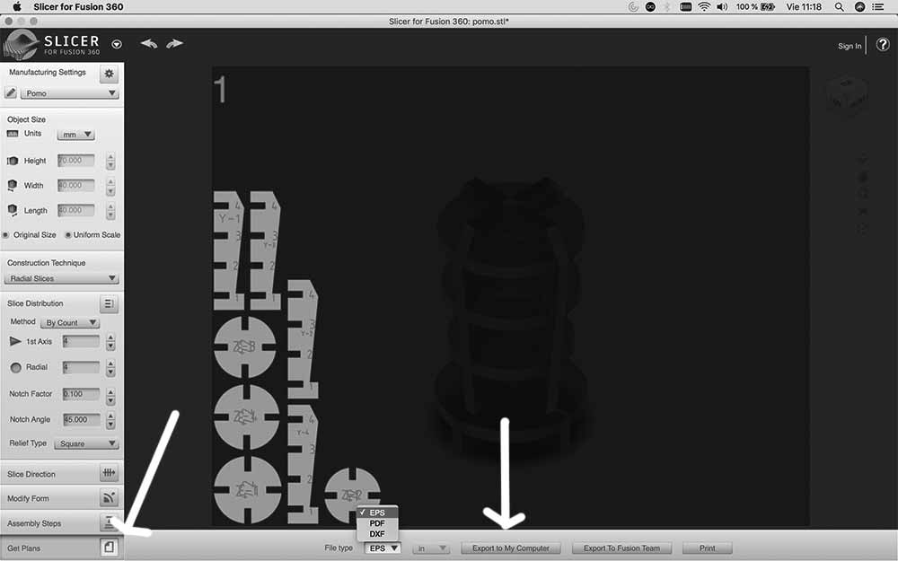

#### Preparar una imegen para grabar con láser 
**[Ricardo Espinosa Ruiz](https://www.ucm.es/directorio?id=30024)**  
Para este proyecto vamos a ver paso a paso como prearar un archivo para grabar con la máquina láser.  

Antes de preparar cualquier archivo para la cortadora láser, es fundamental entender qué tipo de trabajo queremos hacer. **Cortar** significa que el láser atraviesa completamente el material, separando piezas. **Grabar** (raster) implica quemar la superficie para generar una imagen o textura sin llegar a atravesarla. Por último, el **marcado** consiste en trazar líneas finas superficiales, normalmente más rápidas y menos profundas que un grabado raster. Distinguir correctamente entre estos tres procesos desde el inicio evita errores en la preparación del archivo y ahorra tiempo y material.
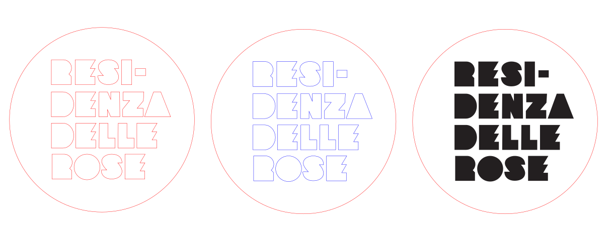  

